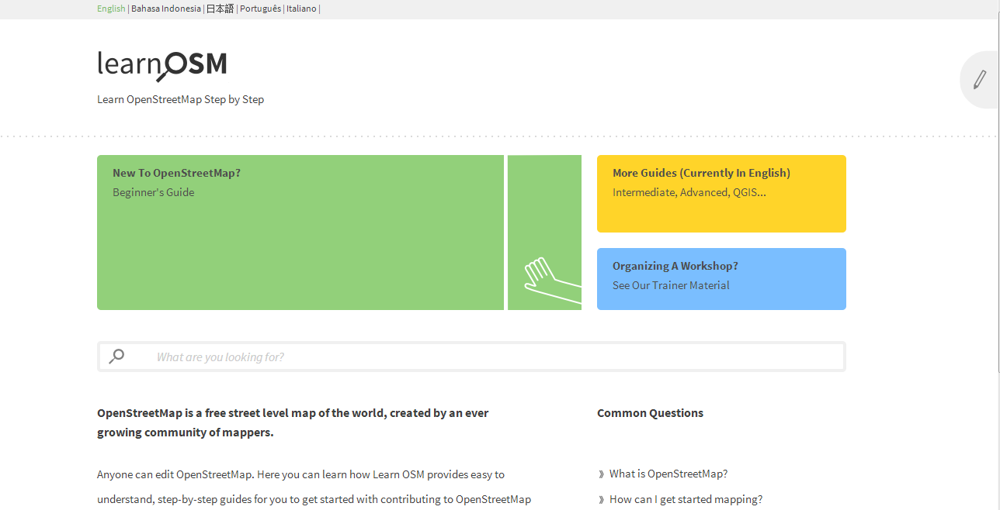
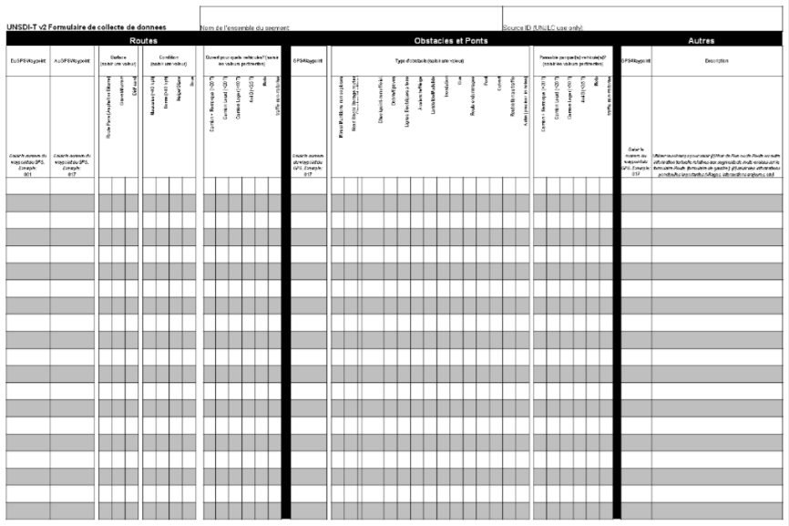
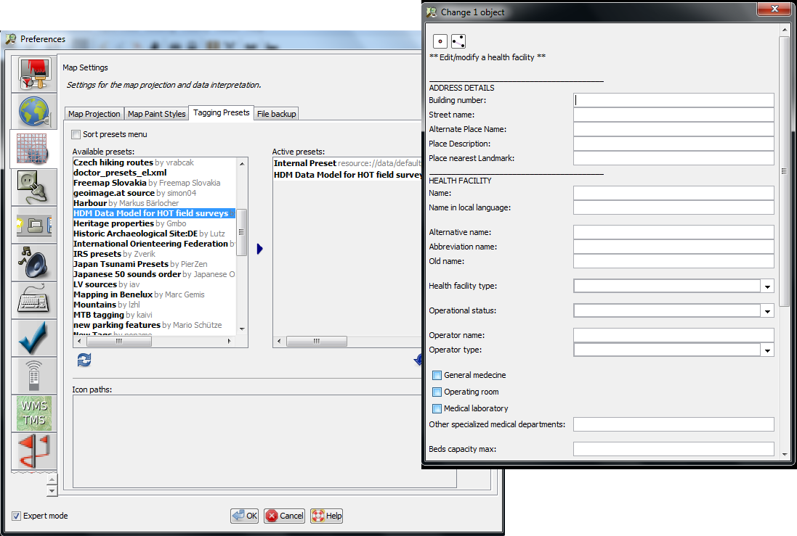
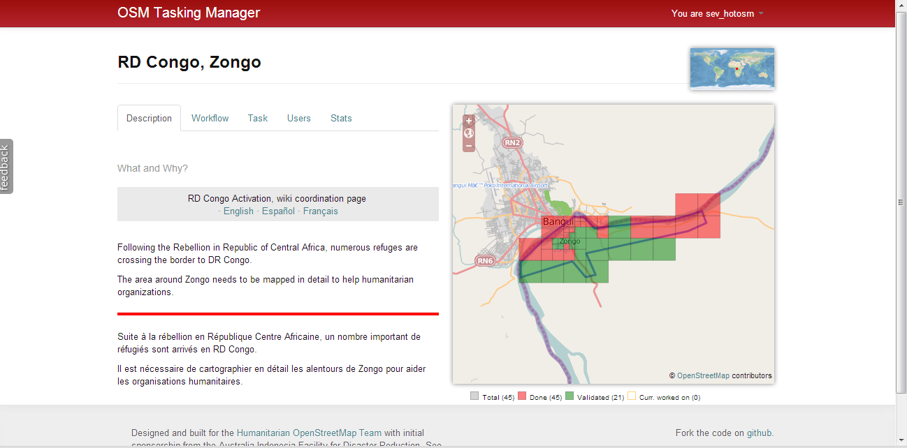
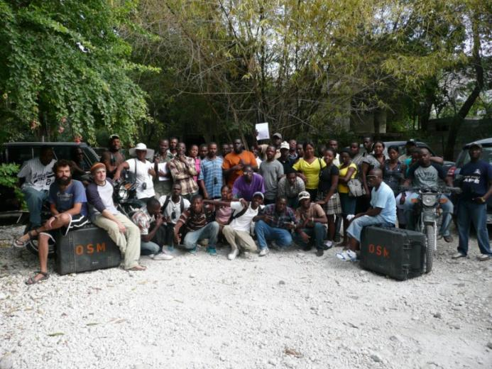

<!-- .slide: data-background="resources/osm_background.png" -->

<h1>Geovoluntariado con HOT</h1>

<h3>Ayudando al mundo a través de la cartografía</h3>

<ul>
  <li> Jorge Sanz </li>
  <li> Pedro-Juan Ferrer </li>
  <li> UPV - 2016-06-29 </li>
</ul>

---

## OSM y los datos humanitarios

> Los datos libres y abiertos son tremendamente beneficiosos para la ayuda
> humanitaria y el desarrollo económico.

___

## El mejor mapa de Puerto Principe

|  |   <!-- .element: class="fragment" -->|
| :---:                                  | :---:                                   |
| OSM, 12 de enero, 2010                 | 28 días después                         |

___

## Puente cartográfico

ONG creada en agosto de 2010

___

## Red Humanitaria Digital

---

## HOT Package

* Learn OSM
* Estadillos de campo
* Configuraciones de JOSM
* Tasking Manager
* Comunidad
___

## learnosm.org

___

## Estadillos de campo

___

## Configuraciones de JOSM

___

## Tasking Manager

___

## Comunidad

---

## Missing Map

