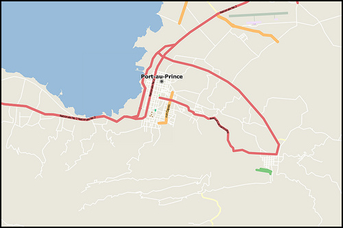
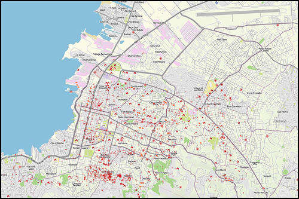

Geovoluntariado con HOT: ayudando al mundo a través de la cartografía
==============================================================================

* Jorge Sanz
* Pedro-Juan Ferrer
* UPV - 2016-06-29

---

## OSM y los datos humanitarios

> Los datos libres y abiertos son tremendamente beneficiosos para la ayuda
> humanitaria y el desarrollo económico

## El mejor mapa de Puerto Principe

|  |  |
| :---:                                  | :---:                                   |
| OSM, 12 de enero, 2010                 | 28 días después                         |

## Puente cartográfico

ONG creada en agosto de 2010

## Parte de la Red Humanitaria Digital

